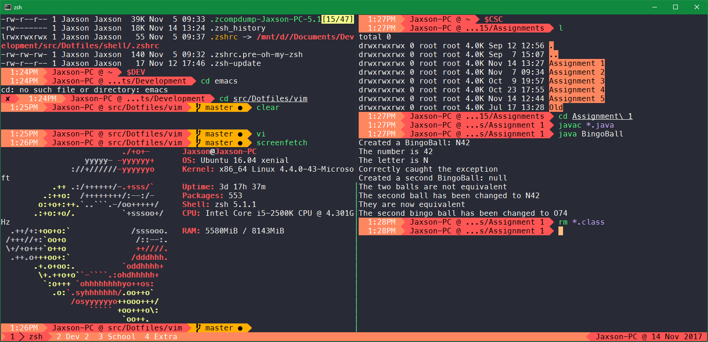

# tmux-airline-wracula

A tmux theme based on [tmux-airline-dracula](https://github.com/sei40kr/tmux-airline-dracula).



## Installation

1. Install using tpm.

    ```tmux
    set -g @plugin 'woofers/tmux-airline-wracula'
    ```

## Manual Installation

1. Clone this repository.

    ```sh
    git clone --depth=1 https://github.com/woofers/tmux-airline-wracula.git
    ```

1. Add following to your `.tmux.conf`.

    ```tmux
    run-shell '. /path/to/tmux-airline-wracula/airline-wracula.tmux'
    ```
